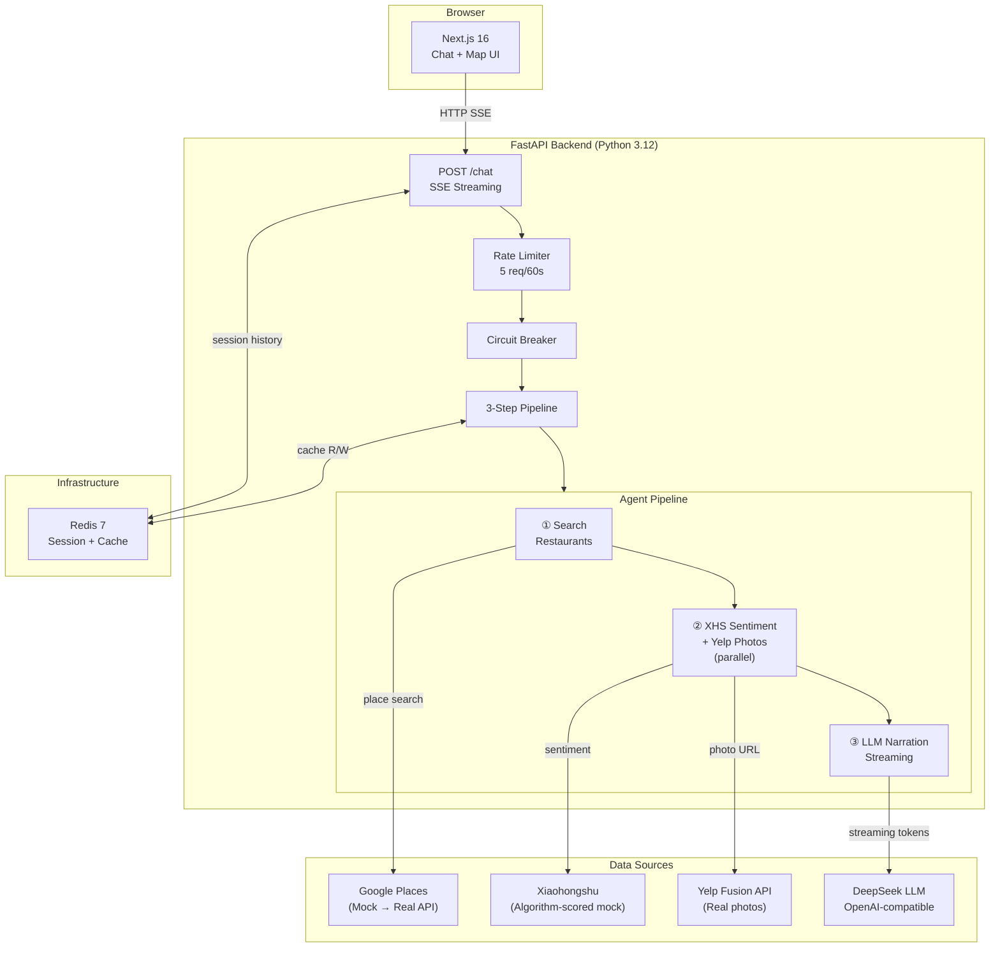
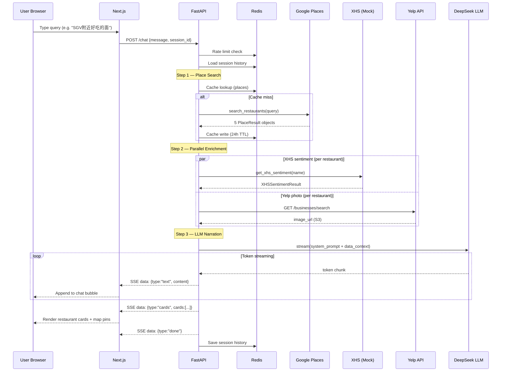
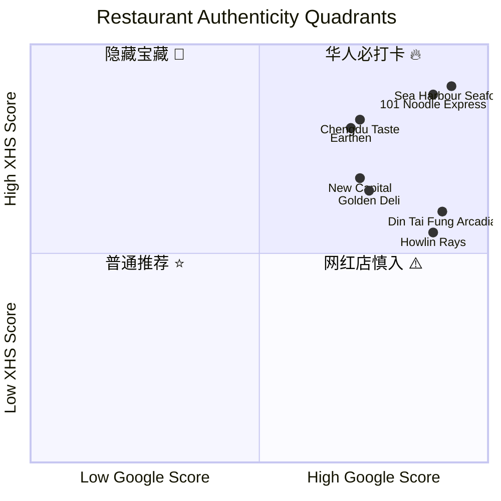

# US Foodie Scout 🔍🍜

> **北美华人美食侦探** — AI-powered restaurant discovery platform for the Chinese community in Los Angeles

[](https://fastapi.tiangolo.com)
[](https://nextjs.org)
[](https://python.org)
[](https://typescriptlang.org)
[](https://redis.io)
[](https://docs.docker.com/compose)

---

## Overview

US Foodie Scout bridges two data worlds that most English-first apps ignore: **Google Maps** (broad coverage, tourist-skewed) and **Xiaohongshu / RedNote** (小红书, China's leading lifestyle social platform). By cross-referencing both, the app surfaces an authenticity score that answers the question Chinese expats actually ask — *"Is this place legitimately good, or just Instagram-famous?"*

Users interact through a natural-language chat interface. The backend runs a deterministic three-step AI pipeline: search → sentiment enrichment → streaming LLM narration. Results appear as restaurant cards with dual Google/XHS score bars, a photo strip, and an authenticity quadrant tag.

---

## Features

| Feature | Detail |
|---|---|
| 🤖 **AI Chat Agent** | Natural-language queries in Chinese or English; streaming SSE responses |
| 📊 **Dual-Score System** | Google Places score (0–100) × XHS community sentiment score (0–100) |
| 🏷️ **Authenticity Quadrants** | 4 tags: 华人必打卡 / 隐藏宝藏 / 网红店慎入 / 普通推荐 |
| 🗺️ **Live Map Sync** | Leaflet map pins sync with selected restaurant card |
| 🖼️ **Real Restaurant Photos** | Yelp Fusion API — actual restaurant photos, not stock images |
| ⚡ **Redis Caching** | 24h places cache, 6h XHS cache — near-zero latency on repeat queries |
| 🛡️ **Rate Limiting** | Sliding-window rate limiter (5 req / 60s per IP) backed by Redis |
| 🔌 **Circuit Breaker** | Auto-isolates failing external services; graceful fallback |
| 🌐 **i18n** | Full Chinese / English UI toggle |
| 🐳 **Docker Compose** | One command to run the full stack locally |

---

## System Architecture



---

## Request Flow



---

## Authenticity Scoring System

The core insight: Google ratings are tourist-inclusive, XHS ratings reflect the **Chinese community's actual experience**. Cross-referencing the two creates a meaningful 2×2 matrix.



### XHS Score Algorithm

The XHS score (0–100) is computed from three weighted components — not hardcoded:

```
score = volume_score(0–40) + engagement_score(0–40) + sentiment_score(0–20)

volume_score    = min(40, log(1 + post_count) × 6.5)
engagement_score = min(40, log(1 + saves×3 + likes + comments×0.5) × 5.5)
sentiment_score  = clamp(10 + (pos_weight − neg_weight) × 0.8, 0, 20)
```

**Key insight on saves:** Saves are weighted 3× because disappointed diners don't bookmark places for future visits — low save-to-like ratios are a strong signal of overhyped restaurants.

---

## Tech Stack

### Backend
| Layer | Technology |
|---|---|
| Web Framework | FastAPI 0.115 + uvicorn |
| AI / LLM | LangChain 0.3 + DeepSeek (OpenAI-compatible) |
| Streaming | Server-Sent Events (SSE) via `sse-starlette` |
| Cache & Session | Redis 7 |
| Resilience | Custom circuit breaker + sliding-window rate limiter |
| Photos | Yelp Fusion API |
| Data Validation | Pydantic v2 |
| Testing | pytest + pytest-asyncio |

### Frontend
| Layer | Technology |
|---|---|
| Framework | Next.js 16 (App Router) + React 19 |
| Language | TypeScript 5 |
| Styling | Tailwind CSS v4 |
| UI Components | shadcn/ui + Radix |
| Map | Leaflet + react-leaflet |
| i18n | Custom lightweight client |

---

## Project Structure

```
US Foodie Scout/
├── .env.example              # Environment variable template (copy → .env)
├── .gitignore
├── docker-compose.yml        # Full-stack: Redis + Backend + Frontend
│
├── backend/
│   ├── main.py               # FastAPI app, /chat SSE endpoint, session management
│   ├── requirements.txt
│   ├── Dockerfile
│   │
│   ├── agent/
│   │   └── react_agent.py    # 3-step deterministic pipeline + LLM streaming
│   │
│   ├── core/
│   │   ├── config.py         # Pydantic settings (reads from .env)
│   │   ├── rate_limiter.py   # Redis sliding-window rate limiter
│   │   └── circuit_breaker.py
│   │
│   ├── schemas/
│   │   └── models.py         # RestaurantCard, ChatRequest, AuthenticityTag
│   │
│   ├── tools/
│   │   ├── google_places_mock.py   # Mock Google Places (28 LA restaurants)
│   │   ├── xhs_sentiment_mock.py   # Mock XHS with algorithm-computed scores
│   │   ├── xhs_scorer.py           # Volume × Engagement × Sentiment formula
│   │   ├── xhs_sentiment.py        # Real XHS client (needs cookie)
│   │   ├── xhs_client.py
│   │   └── yelp_photos.py          # Yelp Fusion photo fetcher
│   │
│   └── tests/
│       ├── unit/             # XHS scorer, mock data, circuit breaker, models
│       └── integration/      # API endpoint tests
│
└── frontend/
    ├── app/
    │   ├── page.tsx          # Root layout: ChatPanel + MapPanel split view
    │   └── layout.tsx
    │
    ├── components/
    │   ├── chat/
    │   │   ├── ChatPanel.tsx       # Chat input + message thread
    │   │   ├── RestaurantCard.tsx  # Score bars, photo, quadrant tag, CTA
    │   │   └── MessageBubble.tsx
    │   ├── map/
    │   │   └── MapPanel.tsx        # Leaflet map, synced pins
    │   └── layout/
    │       └── LanguageToggle.tsx  # ZH/EN switcher
    │
    ├── hooks/
    │   ├── useChat.ts        # SSE streaming consumer, card parsing
    │   └── useSession.ts     # UUID session management
    │
    └── lib/
        ├── types.ts          # RestaurantCard, AuthenticityTag TypeScript types
        ├── api.ts            # Fetch wrapper for /chat
        └── i18n.ts           # Translation strings
```

---

## Getting Started

### Prerequisites

- Python 3.12+
- Node.js 20+
- Redis 7 (or Docker)
- [DeepSeek API key](https://platform.deepseek.com) — free tier available
- [Yelp Fusion API key](https://www.yelp.com/developers/v3/manage_app) — free, no billing required

### Option A — Local Development

**1. Clone and configure environment**

```bash
git clone https://github.com/your-username/us-foodie-scout.git
cd us-foodie-scout

cp .env.example .env
# Edit .env — fill in DEEPSEEK_API_KEY and YELP_API_KEY at minimum
```

**2. Start Redis**

```bash
# With Docker (easiest):
docker run -d -p 6379:6379 redis:7-alpine

# Or with Homebrew (macOS):
brew services start redis
```

**3. Backend**

```bash
cd backend
python -m venv .venv && source .venv/bin/activate
pip install -r requirements.txt

PYTHONPATH=. uvicorn main:app --reload
# → http://localhost:8000
# → http://localhost:8000/docs  (Swagger UI)
```

**4. Frontend**

```bash
cd frontend
npm install
npm run dev
# → http://localhost:3000
```

### Option B — Docker Compose (Full Stack)

```bash
cp .env.example .env
# Edit .env with your API keys

docker compose up --build
# → Frontend: http://localhost:3000
# → Backend:  http://localhost:8000
# → Redis:    localhost:6379
```

### Running Tests

```bash
cd backend
pip install -r requirements-test.txt
pytest tests/ -v
```

---

## Environment Variables

Copy `.env.example` to `.env` and fill in the required values.

| Variable | Required | Description |
|---|---|---|
| `DEEPSEEK_API_KEY` | ✅ | LLM API key — [get one free](https://platform.deepseek.com) |
| `DEEPSEEK_MODEL` | — | Default: `deepseek-chat` |
| `YELP_API_KEY` | ✅ | Restaurant photos — [get one free](https://www.yelp.com/developers/v3/manage_app) |
| `REDIS_URL` | — | Default: `redis://localhost:6379` |
| `RATE_LIMIT_REQUESTS` | — | Max requests per window. Default: `5` |
| `RATE_LIMIT_WINDOW_SECONDS` | — | Rate limit window. Default: `60` |
| `XHS_USE_REAL` | — | Set `true` to use live XHS data (requires cookie). Default: `false` |
| `XHS_COOKIE` | — | XHS session cookie (see below) |
| `ALLOWED_ORIGINS` | — | Comma-separated CORS origins for production |
| `GOOGLE_PLACES_API_KEY` | — | For real place search (mock used when absent) |

> **XHS Real Data Note:** The app ships with algorithm-scored mock data covering 28 restaurants across SGV, DTLA, Koreatown, Rowland Heights, and Irvine. To enable live XHS scraping, set `XHS_USE_REAL=true` and provide a valid `XHS_COOKIE` from an active session at xiaohongshu.com.

---

## API Reference

### `POST /chat`

Streaming SSE endpoint. Returns a sequence of events:

```bash
curl -X POST http://localhost:8000/chat \
  -H "Content-Type: application/json" \
  -d '{"message": "SGV附近好吃的早茶", "session_id": "abc123", "lang": "zh"}'
```

**Request body**

```jsonc
{
  "message": "SGV附近好吃的早茶",  // required, max 500 chars
  "session_id": "abc123",          // required — persist across turns for context
  "lang": "zh",                    // "zh" | "en"
  "budget": "$$",                  // optional: "$" | "$$" | "$$$" | "$$$$"
  "cuisine": "粤式"                // optional: free-text cuisine filter
}
```

**SSE event stream**

```
data: {"type": "text", "content": "根据你的"}
data: {"type": "text", "content": "需求，推荐…"}
data: {"type": "cards", "cards": [{...}, {...}]}
data: {"type": "done"}
```

**RestaurantCard schema**

```jsonc
{
  "name": "Sea Harbour Seafood Restaurant",
  "name_zh": "海港海鲜酒家",
  "address": "3939 Rosemead Blvd, Rosemead, CA 91770",
  "lat": 34.073,
  "lng": -118.0789,
  "google_score": 92.0,          // 0-100
  "xhs_score": 88.4,             // 0-100, algorithm-computed
  "price_level": "$$",
  "authenticity_tag": "华人必打卡",
  "cuisine_type": "粤式早茶",
  "google_maps_url": "https://maps.google.com/...",
  "xhs_post_count": 2187,
  "photo_url": "https://s3-media0.fl.yelpcdn.com/...",
  "highlight": "LA最强早茶、虾饺无敌、必点流沙包"
}
```

### `GET /health`

```json
{"status": "ok", "redis": true, "version": "0.1.0"}
```

### `GET /session/{session_id}/history`

Returns the conversation history for a session.

### `DELETE /session/{session_id}`

Clears a session's conversation history from Redis.

---

## Deployment

### Recommended Stack

| Service | Platform | Notes |
|---|---|---|
| Frontend | [Vercel](https://vercel.com) | Set `NEXT_PUBLIC_API_URL` to your backend URL |
| Backend | [Railway](https://railway.app) or [Render](https://render.com) | Add all env vars in the dashboard |
| Redis | Railway Redis plugin or [Upstash](https://upstash.com) | Free tier sufficient |

### Vercel (Frontend)

```bash
cd frontend
npx vercel --prod
# Set environment variable:
# NEXT_PUBLIC_API_URL = https://your-backend.railway.app
```

### Railway (Backend + Redis)

1. New Project → Deploy from GitHub repo
2. Select `backend/` as root directory
3. Add environment variables from `.env.example`
4. Add a Redis plugin — Railway auto-injects `REDIS_URL`

---

## Coverage — LA Restaurant Areas

The mock dataset covers 28 restaurants across 5 areas with all four authenticity quadrants represented:

| Area | Restaurants | Highlights |
|---|---|---|
| SGV / Alhambra / Arcadia | 11 | 101 Noodle, Sea Harbour, Din Tai Fung, Haidilao |
| Monterey Park / Rosemead | 3 | Elite Restaurant, Huge Tree Pastry |
| DTLA / Chinatown / Little Tokyo | 4 | Yang Chow, Sushi Gen, Howlin' Ray's |
| Koreatown / USC | 4 | Park's BBQ, Kang Ho-dong, Broken Mouth |
| Rowland Heights 罗兰岗 | 4 | Earthen, Hui Tou Xiang, Yi Mei Deli |
| Irvine 尔湾 | 5 | Shabu Zone, Newport Seafood, Ling's Garden |

---

## Roadmap

- [ ] Real Google Places API integration (swap mock with live data)
- [ ] Google Maps JS embed (replace Leaflet)
- [ ] Persistent user favorites
- [ ] More cities: San Francisco Bay Area, New York Flushing
- [ ] Real-time XHS scraping via Playwright (stable alternative to cookie auth)
- [ ] Mobile-responsive layout
- [ ] CI/CD pipeline (GitHub Actions → Vercel/Railway)

---

## Contributing

Pull requests welcome. For major changes, open an issue first to discuss what you'd like to change.

```bash
# Run tests before submitting
cd backend && pytest tests/ -v
cd frontend && npm run lint
```

---

## License

MIT
